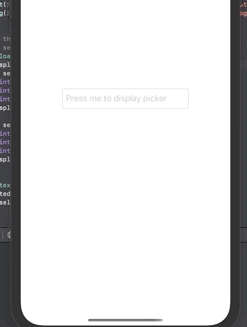

[](https://github.com/omranaleid/UITextFieldPickerInput/blob/master/LICENSE)

# UITextFieldPickerInput
This is a small library to help displaying picker as input view for UITextField with some editable and managable content 


# Installation
The lib is available through [CocoaPods](https://cocoapods.org) CocoaPods can be installed using [Ruby gems](https://rubygems.org):

 `$ gem install cocoapods`
 
 Then simply add `UITextFieldPickerInput` to your Podfile:
 
 `pod 'UITextFieldPickerInput'`
 
# Usage

###  1- Make your model or data type confirms to Selectable protocol

in case you want the selectabel data to be custom model:
```
struct Cat {
    
    var id: Int
    var name: String
    var extraInfo: String
}

extension Cat: Selectable {
    
    var selectableValue: Any {
        return id
    }
    
    var selectableText: String {
        return name
    }
}
```
or for example simple data type as String:
```
extension String: Selectable {
    var selectableText: String {
        return self
    }
    
    var selectableValue: Any {
        return self
    }
}
```
### 2- Defin your data that you want to select from
the key will be the component number and the value will be array of objects that you want to select from.
```
let data: [Int: [Selectable]] = [
  0: [Cat(id: 1, name: "cat1", extraInfo: "asdasd"), Cat(id: 2, name: "cat2", extraInfo: "asdasd")],
  1: [Dog(id: 1, name: "dog1", extraInfo: "asdasd"), Dog(id: 2, name: "dog2", extraInfo: "asdasd")]
 ]
```

### 3- laod the Picker inside the UITextfiled and get the selected values for each component
```
textField.loadPicker(data: data, onSelect: { [weak self] selected in
    var displayedText = ""
    if let selectedCat = selected[0] as? Cat {
        print(selectedCat.extraInfo)
        print(selectedCat.id)
        print(selectedCat.name)
        displayedText = "Cat: \(selectedCat.name)"
    }
    if let selectedDog = selected[1] as? Dog {
        print(selectedDog.extraInfo)
        print(selectedDog.id)
        print(selectedDog.name)
        displayedText.append(" Dog: \(selectedDog.name)")
    }
              
    self?.textField.text = displayedText
  }) { selectedDone in
        print(selectedDone)
}

textField.becomeFirstResponder()
```

# Customize UI and update data

### If you want to change the UI (as colors or texts ...) you can use the `PickerInputSettings`
This will allow you to update the following props and it's default values
```
     cancelButtonTitle: String = "Cancel"
     doneButtonTitle: String = "Done"
     toolBarStyle: UIBarStyle = .black
     toolBarIsTranslucent: Bool = true
     toolBarTintColor: UIColor = .black
     toolBarBarTintColor: UIColor = .lightGray
     hideDoneButton: Bool = false
     hideCancelButton: Bool = false
     isToolBarHidden: Bool = false
     hideWhenSelect: Bool = false
```    
 for example 
```
   var settings: PickerInputSettings = PickerInputSettings()
   settings.cancelButtonTitle = "new Title"
   settings.hideWhenSelect = true
   textField.updatePickerInput(with: settings)
   ```

### You can update data for specific component by using

   ```
textField.updatePickerInput(with: [Cat(id: 1, name: "updated cat 1", extraInfo: "foo"),
                                    Cat(id: 2, name: "updated cat 2", extraInfo: "foo")],
                                    component: 0)
   ```
### Or update all component
Just define a new data and pass it to

 ```
textField.updatePickerInput(with: [Int : [Selectable]])
 ```
